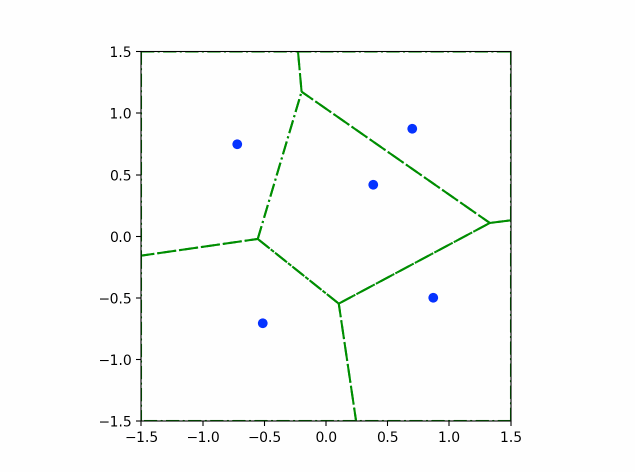

# python-vehicle-routing
Python implementation of Dynamic Vehicle Routing (DVR) algorithms

 |  Random Assignment  | First-Come-First-Serve |
 | :-----------------: | :--------------------: |
 |  |       |

|    m-SQM Policy    | UTSP (queue size = 5) |
| :----------------: | :-------------------: |
|  |      |

| m-DC Policy (distributed partitioning) | No-Communication (NC) Policy |
| :------------------------------------: | :--------------------------: |
|            |               |

## Supported Platform:
- Anaconda on Ubuntu 20.04 LTS
- Miniforge on Apple M1 Mac

## Usage
1. Install required dependency:
```bash
conda env create -f environment.yml
```

2. Execute main script:
```bash
conda activate python_dvr
python src/main.py
```

## Overview
This repo reviews the following DVR algorithms:
* Random assignment (vanilla)
* First-Come-First-Serve (FCFS)
* m-SQM (Stochastic Queue Median) policy
* UTSP (Unbiased Traveling Salesman Problem) policy

## References
- Visualization framework from MEAM 624: Distributed Robotics, University of Pennsylvania, Spring 2022.
- F. Bullo, E. Frazzoli, M. Pavone, K. Savla and S. L. Smith, "[Dynamic Vehicle Routing for Robotic Systems](https://ieeexplore.ieee.org/abstract/document/5954127?casa_token=sAaSTkWYbO8AAAAA:eE9HJHY242a0InCpEhtyF0-iPnP2DSIq73AVHbDkbQVy-yuM4i_RGsC-RiwneH00c-z6EfxoNdU)," in Proceedings of the IEEE, vol. 99, no. 9, pp. 1482-1504, Sept. 2011, doi: 10.1109/JPROC.2011.2158181.